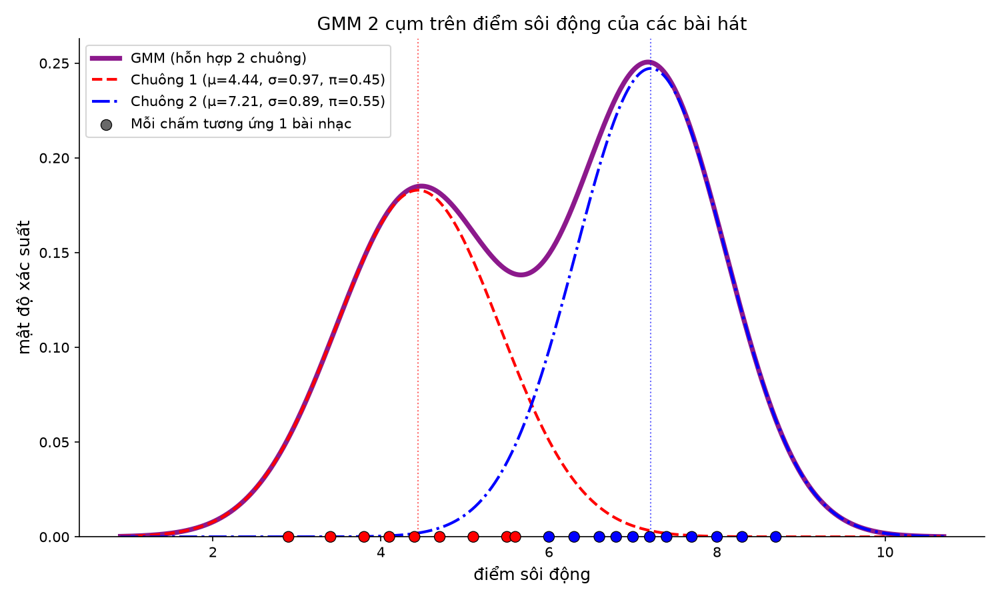

# Gaussian Mixture Model — phân cụm điểm sôi động của bài hát

Huấn luyện một Gaussian Mixture Model (GMM) 2 cụm trên tập dữ liệu 1 chiều là
cột `diemSoiDong` của `data/BaiHat.csv`, rồi vẽ 2 đường chuông thành phần cùng
đường mật độ hỗn hợp (GMM).

## Cấu trúc thư mục

```
.
├── data/BaiHat.csv      # dữ liệu: tenBaiHat, diemSoiDong
├── src/gmm_baihat.py    # huấn luyện GMM + vẽ biểu đồ
├── requirements.txt     # thư viện cần cài
└── gmm_baihat.png       # biểu đồ sinh ra sau khi chạy
```

## Yêu cầu

- Python >= 3.9 (kiểm tra bằng `python3 --version`)
- Các thư viện trong `requirements.txt`: numpy, pandas, matplotlib, scikit-learn

## Cài đặt và chạy (máy mới clone về)

```bash
git clone https://github.com/dinhdatthong1809/gaussian-mixture-model.git
cd gaussian-mixture-model

# 1. Tạo môi trường ảo (khuyến nghị, để không đụng Python hệ thống)
python3 -m venv .venv
source .venv/bin/activate        # Windows: .venv\Scripts\activate

# 2. Cài thư viện
pip install -r requirements.txt

# 3. Chạy
python3 src/gmm_baihat.py
```

Script dùng đường dẫn tính theo vị trí file nên chạy từ thư mục nào cũng được,
ví dụ `python3 /duong/dan/toi/repo/src/gmm_baihat.py`.

Khi xong, thoát môi trường ảo bằng `deactivate`.

## Kết quả

Script in ra tham số của mô hình và bảng bài hát kèm cụm được gán:

```
Cụm 1: pi=0.447  mu=4.442  sigma=0.974
Cụm 2: pi=0.553  mu=7.212  sigma=0.893
Hội tụ: True | log-likelihood trung bình: -1.858
```

- `pi` — trọng số (tỉ lệ) của cụm
- `mu` — điểm sôi động trung bình của cụm
- `sigma` — độ lệch chuẩn của cụm

Đồng thời lưu biểu đồ `gmm_baihat.png` ở thư mục gốc repo:

- đường tím dày: mật độ GMM (tổng 2 chuông)
- đường đỏ nét đứt: chuông 1 (nhóm ít sôi động)
- đường xanh gạch-chấm: chuông 2 (nhóm sôi động)
- mỗi chấm trên trục X là 1 bài nhạc, tô màu theo cụm được gán



## Ghi chú

- Cửa sổ biểu đồ mở qua `plt.show()`. Trên máy không có giao diện đồ hoạ
  (server, WSL không cấu hình X), lệnh này bị bỏ qua — cứ xem file
  `gmm_baihat.png`, hoặc chạy `MPLBACKEND=Agg python3 src/gmm_baihat.py` cho
  gọn cảnh báo.
- Muốn đổi số cụm, sửa `n_components=2` trong `src/gmm_baihat.py`.
- Muốn dùng dữ liệu khác, thay `data/BaiHat.csv` nhưng giữ nguyên tên 2 cột
  `tenBaiHat` và `diemSoiDong`.
