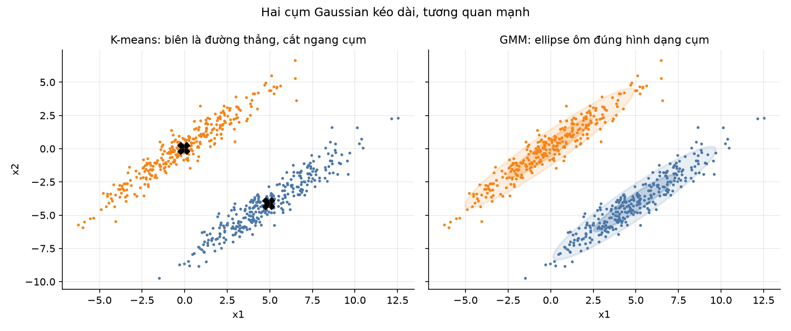
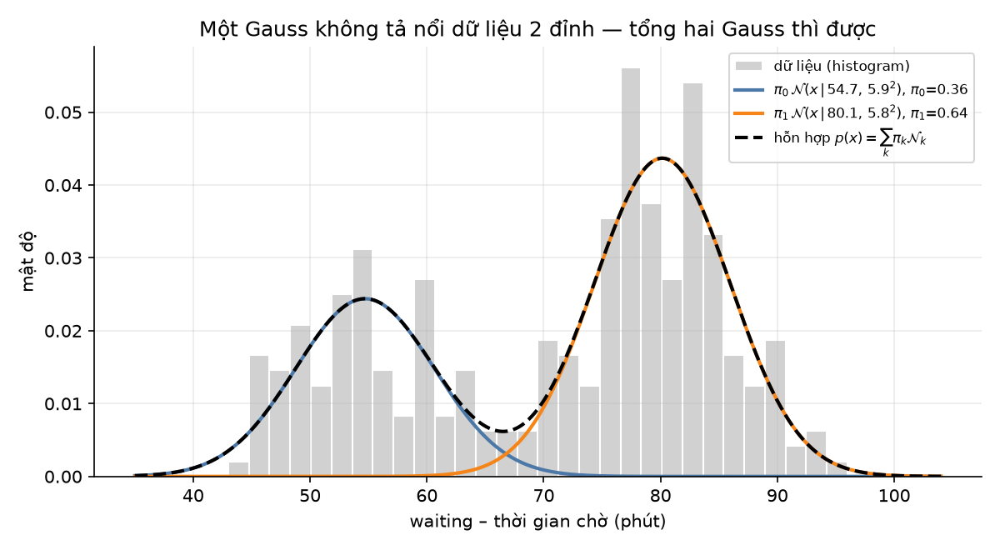
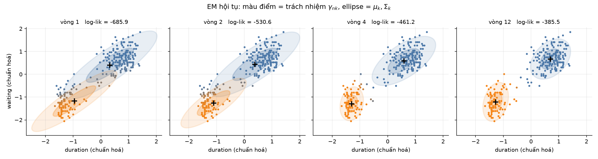
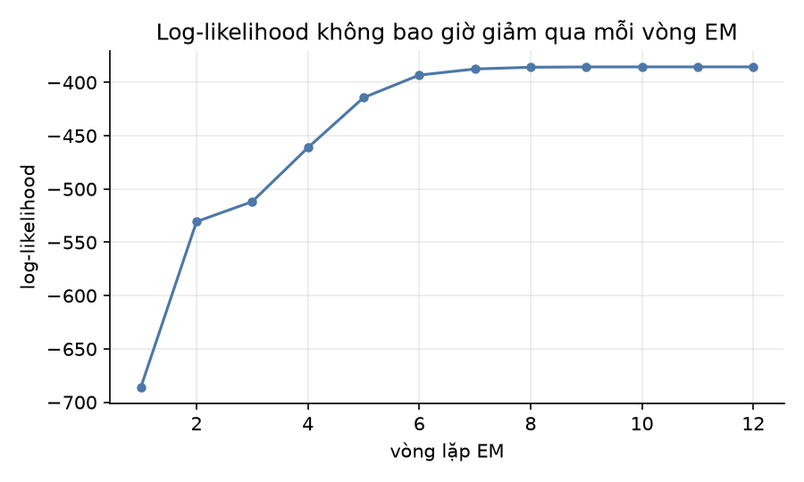
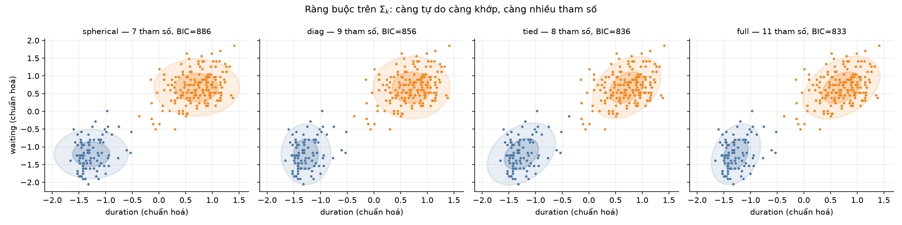
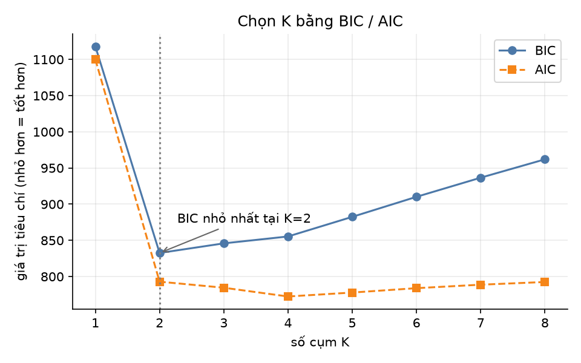
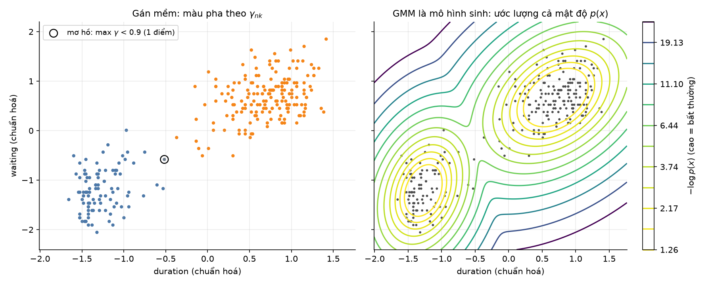

# Gaussian Mixture Models & Expectation–Maximization

> Báo cáo cho đề tài *Clustering: Gaussian Mixture Models and Expectation-Maximization method*.
> Mã nguồn, dữ liệu và toàn bộ hình vẽ trong báo cáo được sinh lại bằng `python3 report/make_figures.py`.

---

## 1. Bài toán GMM cố giải quyết

**Phân cụm (clustering)**: cho tập dữ liệu không nhãn $X=\{x_1,\dots,x_N\}$, hãy tìm cấu trúc nhóm ẩn bên trong.

K-means — thuật toán kinh điển — giải bài toán này bằng cách gán *cứng*: mỗi điểm thuộc về đúng một cụm, cụm gần nhất theo khoảng cách Euclid. Cách làm đó có ba điểm yếu:

| Hạn chế của K-means | Hệ quả |
|---|---|
| Gán cứng (hard assignment) | Điểm nằm giữa hai cụm vẫn bị ép về một bên, mất thông tin "không chắc chắn" |
| Khoảng cách Euclid ⇒ biên cụm là **siêu phẳng**, cụm luôn **hình cầu** | Cụm kéo dài / nghiêng / tương quan bị cắt sai |
| Không có mô hình xác suất | Không trả lời được "điểm này khả năng bao nhiêu?", không so sánh được mô hình, không phát hiện bất thường |

<p align="center"></p>

Hình 1: hai cụm Gaussian kéo dài và tương quan mạnh. K-means (trái) cắt bằng một đường thẳng nên xé đôi cả hai cụm; GMM (phải) học được ellipse đúng hướng và tách gần như hoàn hảo.

**GMM giải quyết cả ba**: nó mô hình hoá dữ liệu bằng *xác suất*, mỗi cụm là một phân phối Gaussian có hình dạng riêng, và mỗi điểm thuộc về mọi cụm với một *mức độ* nào đó.

---

## 2. Ý tưởng: mô hình sinh dữ liệu

GMM giả định dữ liệu được sinh ra theo hai bước:

1. **Chọn cụm**: bốc ngẫu nhiên một cụm $k \in \{1..K\}$ với xác suất $\pi_k$ (trọng số trộn, $\sum_k \pi_k = 1$).
2. **Sinh điểm**: lấy $x \sim \mathcal{N}(\mu_k, \Sigma_k)$ từ Gaussian của cụm đó.

Ta chỉ quan sát được $x$, còn *nhãn cụm $z$ thì bị giấu* — đó là **biến ẩn (latent variable)**. Phân cụm chính là việc đi ngược quá trình sinh: từ $x$ suy ra $z$ và các tham số $\pi_k,\mu_k,\Sigma_k$.

Lấy tổng qua mọi cụm được **mật độ hỗn hợp**:

$$p(x) = \sum_{k=1}^{K} \pi_k\, \mathcal{N}(x \mid \mu_k, \Sigma_k)$$

<p align="center"></p>

Hình 2: thời gian chờ giữa hai lần phun của mạch nước Old Faithful có **hai đỉnh**. Một Gaussian đơn không thể tả nổi; tổng có trọng số của hai Gaussian (đường nét đứt) khớp rất sát histogram.

---

## 3. Toán học, bắt đầu từ trường hợp đơn giản nhất (1 chiều)

### 3.1 Các công thức nền

Gaussian một chiều:

$$\mathcal{N}(x\mid\mu,\sigma^2) = \frac{1}{\sqrt{2\pi\sigma^2}}\exp\!\left(-\frac{(x-\mu)^2}{2\sigma^2}\right)$$

Mô hình có tham số $\theta = \{\pi_k, \mu_k, \sigma_k^2\}_{k=1}^K$. Hàm hợp lý (likelihood) của toàn bộ dữ liệu, giả định các điểm độc lập:

$$\log p(X\mid\theta) = \sum_{n=1}^{N} \log \left( \sum_{k=1}^{K} \pi_k \,\mathcal{N}(x_n \mid \mu_k,\sigma_k^2) \right)$$

Mục tiêu: tìm $\theta$ làm cực đại biểu thức trên (ước lượng hợp lý cực đại – MLE).

### 3.2 Vì sao không giải trực tiếp được?

Với **một** Gaussian, đạo hàm log-likelihood cho nghiệm đóng đẹp đẽ: $\mu = \bar{x}$, $\sigma^2$ = phương sai mẫu. Với hỗn hợp, dấu $\log$ nằm **ngoài** dấu $\sum_k$ nên $\log$ không "ăn" được vào tích, đạo hàm cho ra hệ phương trình rối, không có nghiệm đóng.

Nút thắt nằm ở chỗ: *nếu biết nhãn $z_n$ của từng điểm thì bài toán trở nên tầm thường* — chỉ việc tính trung bình/phương sai trong từng nhóm. Ngược lại, *nếu biết tham số thì tính được nhãn*. Con gà và quả trứng — và EM giải nó bằng cách lặp qua lại giữa hai vế.

### 3.3 Trách nhiệm (responsibility) — E-step

Nếu đã biết $\theta$, dùng định lý Bayes để tính xác suất hậu nghiệm điểm $x_n$ sinh ra từ cụm $k$:

$$\boxed{\;\gamma_{nk} \;=\; p(z_n = k \mid x_n) \;=\; \frac{\pi_k\, \mathcal{N}(x_n\mid\mu_k,\sigma_k^2)}{\sum_{j=1}^{K} \pi_j\, \mathcal{N}(x_n\mid\mu_j,\sigma_j^2)}\;}$$

Đây chính là **gán mềm**: $\gamma_{nk}\in[0,1]$, $\sum_k \gamma_{nk} = 1$. Tử số = "cụm $k$ vừa phổ biến ($\pi_k$) vừa hợp với $x_n$ ($\mathcal{N}$)"; mẫu số chỉ để chuẩn hoá.

### 3.4 Cập nhật tham số — M-step

Coi $\gamma_{nk}$ như "số phiếu" điểm $n$ bỏ cho cụm $k$, rồi tính lại thống kê **có trọng số**. Đặt $N_k = \sum_{n} \gamma_{nk}$ (số điểm *hiệu dụng* của cụm $k$):

$$\pi_k = \frac{N_k}{N}, \qquad
\mu_k = \frac{1}{N_k}\sum_{n=1}^{N} \gamma_{nk}\, x_n, \qquad
\sigma_k^2 = \frac{1}{N_k}\sum_{n=1}^{N} \gamma_{nk}\,(x_n-\mu_k)^2$$

So sánh với K-means: K-means cũng lấy trung bình, nhưng trọng số chỉ là 0/1. **GMM là phiên bản "mềm" của K-means, cộng thêm việc học cả độ rộng và hướng của cụm.**

---

## 4. Thuật toán EM

```
Đầu vào: X, số cụm K
1. Khởi tạo  π, μ, Σ           (thường bằng k-means++)
2. Lặp đến khi hội tụ:
   E-step:  tính γ[n,k] cho mọi n, k          ← dùng θ hiện tại, ước lượng biến ẩn
   M-step:  cập nhật π, μ, Σ từ γ             ← dùng biến ẩn, ước lượng lại θ
   tính log-likelihood; dừng khi mức tăng < tol
Đầu ra: π, μ, Σ và γ (gán mềm)
```

**Tính chất quan trọng**: mỗi vòng EM **không bao giờ làm giảm** log-likelihood. Vì hàm bị chặn trên, thuật toán chắc chắn hội tụ — nhưng chỉ tới một **cực trị địa phương**, không đảm bảo toàn cục.

<p align="center"></p>

Hình 3: EM chạy trên dữ liệu Old Faithful (cài từ đầu bằng NumPy). Màu của điểm pha trộn theo $\gamma_{nk}$ — vòng đầu nhiều điểm còn xám (mơ hồ), đến vòng 12 gần như tất cả đã "dứt khoát". Ellipse là đường đồng mức $1\sigma, 2\sigma$ của từng thành phần.

<p align="center"></p>

Hình 4: log-likelihood tăng đơn điệu qua từng vòng rồi bão hoà — đúng như lý thuyết.

**Vì sao EM đúng?** (tóm tắt) Với phân phối $q(z)$ bất kỳ, bất đẳng thức Jensen cho:

$$\log p(X\mid\theta) \;=\; \underbrace{\mathcal{L}(q,\theta)}_{\text{cận dưới}} + \underbrace{\mathrm{KL}\!\left(q \,\|\, p(Z\mid X,\theta)\right)}_{\ge 0}$$

- **E-step** đặt $q(z) = p(z\mid x,\theta^{old})$, làm KL $= 0$ ⇒ cận dưới *chạm* đúng log-likelihood.
- **M-step** cực đại cận dưới theo $\theta$ ⇒ log-likelihood ít nhất cũng tăng bằng ngần ấy.

Đẩy cận dưới lên, rồi nâng cận dưới chạm lại hàm mục tiêu — lặp mãi thì leo lên đỉnh.

---

## 5. Dạng ma trận: dữ liệu nhiều chiều

Với $x \in \mathbb{R}^d$, Gaussian đa biến là

$$\mathcal{N}(x\mid\mu,\Sigma) = \frac{1}{(2\pi)^{d/2}\,|\Sigma|^{1/2}} \exp\!\left(-\tfrac{1}{2}(x-\mu)^{\!\top}\Sigma^{-1}(x-\mu)\right)$$

trong đó $\mu\in\mathbb{R}^d$, còn $\Sigma \in \mathbb{R}^{d\times d}$ là **ma trận hiệp phương sai** (đối xứng, xác định dương). Đại lượng $(x-\mu)^\top\Sigma^{-1}(x-\mu)$ là **khoảng cách Mahalanobis** bình phương: thay cho khoảng cách Euclid của K-means, nó tự động co giãn theo từng hướng và tính đến tương quan giữa các chiều. Trị riêng của $\Sigma$ cho độ dài các trục của ellipse, vector riêng cho hướng.

Các công thức EM giữ nguyên hình dạng, chỉ đổi vô hướng thành vector/ma trận:

$$\gamma_{nk} = \frac{\pi_k\,\mathcal{N}(x_n\mid\mu_k,\Sigma_k)}{\sum_j \pi_j\,\mathcal{N}(x_n\mid\mu_j,\Sigma_j)}
\qquad N_k=\sum_n \gamma_{nk}$$

$$\pi_k = \frac{N_k}{N},\qquad
\mu_k = \frac{1}{N_k}\sum_n \gamma_{nk}\,x_n,\qquad
\boxed{\;\Sigma_k = \frac{1}{N_k}\sum_n \gamma_{nk}\,(x_n-\mu_k)(x_n-\mu_k)^{\!\top}\;}$$

Lưu ý $(x_n-\mu_k)(x_n-\mu_k)^\top$ là **tích ngoài**, cho ra ma trận $d\times d$ — chứ không phải tích vô hướng.

**Vector hoá toàn bộ** (đặt $X \in \mathbb{R}^{N\times d}$, $\Gamma \in \mathbb{R}^{N\times K}$):

$$\mathbf{N} = \Gamma^{\!\top}\mathbf{1},\qquad
M = \mathrm{diag}(\mathbf{N})^{-1}\,\Gamma^{\!\top} X,\qquad
\Sigma_k = \frac{1}{N_k}\,D_k^{\!\top}\,\mathrm{diag}(\Gamma_{:,k})\,D_k \;\;\text{với}\;\; D_k = X - \mathbf{1}\mu_k^{\!\top}$$

Đây đúng là những dòng code trong `src/gmm_from_scratch.py` — bản cài từ đầu, không dùng thư viện ML.

**Độ phức tạp** mỗi vòng EM: $O(N K d^2)$ cho phần tính mật độ và cập nhật $\Sigma$, cộng $O(K d^3)$ cho phân rã Cholesky. Tuyến tính theo số mẫu $N$ ⇒ mở rộng tốt theo dữ liệu, nhưng **bậc hai/ba theo số chiều** $d$ ⇒ yếu ở dữ liệu nhiều chiều.

### 5.1 Ràng buộc trên $\Sigma_k$ — đánh đổi độ linh hoạt

| Kiểu | Dạng $\Sigma_k$ | Số tham số hiệp phương sai | Hình cụm |
|---|---|---|---|
| `spherical` | $\sigma_k^2 I$ | $K$ | hình tròn, kích thước riêng |
| `diag` | $\mathrm{diag}(\sigma_{k1}^2,\dots)$ | $Kd$ | ellipse song song trục |
| `tied` | $\Sigma$ chung mọi cụm | $d(d{+}1)/2$ | ellipse giống hệt nhau |
| `full` | tự do | $K\,d(d{+}1)/2$ | ellipse bất kỳ, xoay tự do |

<p align="center"></p>

Hình 5: cùng dữ liệu, bốn ràng buộc khác nhau. Dữ liệu ít / nhiều chiều → chọn `diag` hoặc `tied` để tránh quá khớp; dữ liệu nhiều và cụm nghiêng → `full`.

---

## 6. Những chi tiết quyết định thành bại khi triển khai

1. **Khởi tạo**: EM chỉ cho cực trị địa phương. Thực tế luôn khởi tạo bằng **k-means++** và chạy lại nhiều lần (`n_init=10`), giữ nghiệm có log-likelihood cao nhất.
2. **Suy biến (singularity)**: nếu một thành phần "trùm" đúng một điểm, $\Sigma_k \to 0$, mật độ $\to \infty$ và likelihood nổ vô hạn. Cách chữa chuẩn: cộng thêm một lượng nhỏ vào đường chéo, $\Sigma_k \leftarrow \Sigma_k + \varepsilon I$ (`reg_covar=1e-6`).
3. **Ổn định số học**: luôn tính trong không gian **log**, chuẩn hoá $\gamma$ bằng **log-sum-exp**, và nghịch đảo $\Sigma$ qua **phân rã Cholesky** thay vì `inv()`.
4. **Chuẩn hoá đặc trưng**: các chiều lệch thang đo mạnh làm ellipse bị méo và EM hội tụ chậm ⇒ dùng `StandardScaler` trước khi fit.
5. **Chọn số cụm $K$**: dùng tiêu chí phạt độ phức tạp, nhỏ hơn là tốt hơn:

$$\mathrm{BIC} = -2\log p(X\mid\hat\theta) + P\log N, \qquad \mathrm{AIC} = -2\log p(X\mid\hat\theta) + 2P$$

với $P$ = số tham số tự do $= (K-1) + Kd + K\,d(d{+}1)/2$ (kiểu `full`). BIC phạt nặng hơn nên thường chọn mô hình gọn hơn.

<p align="center"></p>

Hình 6: trên Old Faithful, BIC chạm đáy rõ rệt tại $K=2$ — trùng với cấu trúc thật của dữ liệu.

---

## 7. Ưu điểm và nhược điểm

### Ưu điểm

| | |
|---|---|
| **Gán mềm** | Trả về xác suất $\gamma_{nk}$, biết được điểm nào mơ hồ — rất hợp khi cụm chồng lấn |
| **Cụm hình ellipse tuỳ ý** | $\Sigma_k$ học được cả kích thước, độ dẹt và hướng xoay; K-means chỉ làm được hình cầu |
| **Là mô hình sinh (generative)** | Cho luôn mật độ $p(x)$ ⇒ dùng được để **phát hiện bất thường**, **sinh dữ liệu mới**, nén, phân đoạn ảnh |
| **Có nền tảng thống kê** | Chọn $K$ bằng BIC/AIC, so sánh mô hình bằng likelihood — không phải "thử cho đẹp mắt" |
| **Xấp xỉ vạn năng** | Đủ nhiều thành phần thì xấp xỉ được gần như mọi mật độ liên tục |
| **Hội tụ đảm bảo, rẻ theo $N$** | Log-likelihood đơn điệu tăng; chi phí $O(NKd^2)$ mỗi vòng |

### Nhược điểm

| | |
|---|---|
| **Cực trị địa phương** | Kết quả phụ thuộc khởi tạo ⇒ buộc phải chạy nhiều lần (`n_init`) |
| **Phải chọn trước $K$** | BIC/AIC chỉ là heuristic; muốn tự động hơn phải dùng Bayesian GMM (Dirichlet Process) |
| **Giả định Gaussian** | Cụm hình chuối, hình vành khăn, hay dữ liệu lệch/nặng đuôi sẽ bị mô tả sai (khi đó dùng DBSCAN, spectral clustering, hoặc hỗn hợp Student-t) |
| **Suy biến covariance** | Cụm quá ít điểm làm likelihood nổ ⇒ luôn cần regularization |
| **Kém ở số chiều cao** | `full` cần $K\,d(d{+}1)/2$ tham số; $d$ lớn ⇒ quá khớp, tốn bộ nhớ, $\Sigma$ suy biến ⇒ phải PCA trước hoặc dùng `diag` |
| **Nhạy với ngoại lai** | Đuôi Gaussian mỏng nên một điểm xa có thể kéo lệch $\mu,\Sigma$ |
| **Chậm hơn K-means** | Mỗi vòng phải tính định thức, nghịch đảo ma trận cho từng cụm |

### 7.1 So sánh trực tiếp với K-means

| | K-means | GMM |
|---|---|---|
| Gán cụm | cứng (0/1) | mềm (xác suất) |
| Hình cụm | cầu, cùng kích thước | ellipse bất kỳ, kích thước riêng |
| Độ đo | Euclid | Mahalanobis |
| Hàm mục tiêu | tổng bình phương sai số (SSE) | log-likelihood |
| Đầu ra | nhãn | nhãn + xác suất + mật độ $p(x)$ |
| Tham số/cụm | $d$ | $d + d(d{+}1)/2 + 1$ |

**Quan hệ**: cho $\Sigma_k = \sigma^2 I$ với $\sigma^2 \to 0$ và $\pi_k$ bằng nhau, $\gamma_{nk}$ suy biến thành 0/1 và EM **trở thành đúng K-means**. K-means là trường hợp giới hạn của GMM.

---

## 8. Kết quả thực nghiệm (bộ dữ liệu Old Faithful)

**Dữ liệu**: 272 lần phun của mạch nước phun Old Faithful (Yellowstone) — `data/old_faithful.csv`, 2 đặc trưng `duration` (thời gian phun, phút) và `waiting` (thời gian chờ đến lần kế, phút). Cột `kind` (`short`/`long`) là nhãn tham chiếu, **không** đưa vào lúc train, chỉ dùng để chấm điểm.

Chọn $K$ bằng BIC (`covariance_type='full'`):

| K | 1 | **2** | 3 | 4 | 5 | 6 |
|---|---|---|---|---|---|---|
| BIC | 1118.0 | **832.6** | 839.3 | 853.9 | 881.2 | 910.7 |

Mô hình chọn được, $K=2$, hội tụ sau 10 vòng EM:

| cụm | $\pi_k$ | duration (phút) | waiting (phút) |
|---|---|---|---|
| 0 | 0.356 | ≈ 2.04 | ≈ 54.5 |
| 1 | 0.644 | ≈ 4.29 | ≈ 80.0 |

Đối chiếu với nhãn thật:

```
nhãn thật     long   short
cụm 0            1      96
cụm 1          171       4
Adjusted Rand Index = 0.9272   (5/272 điểm lệch, ~98.2% khớp)
```

Độ tin cậy trung bình $\max_k \gamma_{nk} = 0.9991$; **chỉ 1/272 điểm thực sự mơ hồ** ($<0.9$).

<p align="center"></p>

Hình 7: (trái) màu pha theo $\gamma_{nk}$, vòng tròn đen đánh dấu điểm mơ hồ — thứ mà K-means không bao giờ chỉ ra được. (phải) đường đồng mức $-\log p(x)$: GMM cho luôn một hàm mật độ, nên điểm ở vùng sáng chính là ứng viên **bất thường**.

Ví dụ dự đoán điểm mới:

```
duration  waiting  cụm   P(cụm 0)  P(cụm 1)   log p(x)
     4.1     82.0    1     0.0000    1.0000     -0.627   ← chắc chắn "long"
     1.9     54.0    0     1.0000    0.0000     -0.651   ← chắc chắn "short"
     3.0     68.0    1     0.0777    0.9223     -5.562   ← nằm giữa, mô hình thừa nhận sự mơ hồ
```

---

## 9. Ứng dụng thực tế

- **Phân khúc khách hàng**: khách hàng có thể thuộc nhiều nhóm với mức độ khác nhau — gán mềm hợp lý hơn gán cứng.
- **Phát hiện bất thường / gian lận**: ngưỡng trên $\log p(x)$.
- **Nhận dạng tiếng nói**: GMM–HMM là kiến trúc chuẩn trước kỷ nguyên deep learning; vector đặc trưng MFCC được mô hình bằng GMM.
- **Phân đoạn ảnh, trừ nền video**: mỗi pixel là một hỗn hợp Gaussian theo thời gian.
- **Ước lượng mật độ & sinh dữ liệu**: sinh mẫu tổng hợp, làm mượt, nén dữ liệu.

---

## 10. Tóm tắt một câu

> GMM giả định dữ liệu là hỗn hợp có trọng số của nhiều Gaussian; EM ước lượng tham số bằng cách lặp giữa **E-step** (biết tham số → tính xác suất mỗi điểm thuộc mỗi cụm) và **M-step** (biết xác suất → tính lại trọng số, tâm và hiệp phương sai), đảm bảo log-likelihood tăng đơn điệu cho đến khi hội tụ.

## Tài liệu tham khảo

1. C. M. Bishop, *Pattern Recognition and Machine Learning*, Springer 2006 — Chương 9 (Mixture Models and EM).
2. A. P. Dempster, N. M. Laird, D. B. Rubin, "Maximum Likelihood from Incomplete Data via the EM Algorithm", *JRSS-B*, 1977.
3. K. P. Murphy, *Machine Learning: A Probabilistic Perspective*, MIT Press 2012 — Chương 11.
4. Tài liệu scikit-learn: <https://scikit-learn.org/stable/modules/mixture.html>
5. Dữ liệu Old Faithful: Azzalini & Bowman (1990), *JRSS-C* 39(3); bản CSV lấy từ kho `seaborn-data`.
